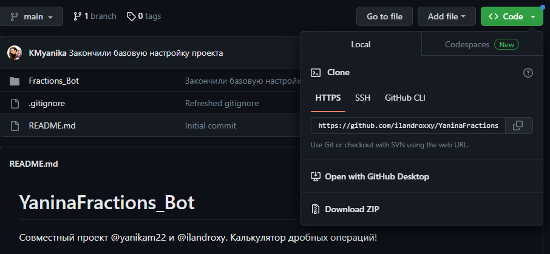

# YaninaFractions_Bot
Совместный проект [@yanikam22](t.me/yanikam22) и [@ilandroxy](t.me/ilandroxy).  Калькулятор дробных операций!

Это совместный проект ученицы 6 класса [@yanikam22](t.me/yanikam22) и репетитора по информатике [@ilandroxy](t.me/ilandroxy). 
Цель проекта: Реализовать вычисления суммы, разности, умножения и деления обыкновенных правильных и неправильных дробей. Если вы хотите вычислить смешанные дроби или целые числа, то приведите их к неправильному виду!

### Инструкция

1. Копируем ссылку на проект

2. Через git clone (ссылка) переносим удалённый репозиторий на локальный компьютер
3. Активируем виртуальное окружение через команды: python -m venv venv и venv\Scripts\activate
4. Устанавливаем библиотеки используя команду pip install -r requirements.txt

### Команды git:

1. git add . #инициализирует commit

2. git commit -m " " - #добавляет комментарий к commit

3. git push - #передаёт данные на сервер

4. git pull - #передаёт данные сервера на компьютер

5. git rm filename - 

6. git rm -r foldername -

### Настраиваем виртуальное окружение python venv:

1. python -m venv venv  #создание  виртуального окружения

2. venv\Scripts\activate  #активировать  виртуальное окружение

### Работа с билиотеками python через pip:

1. pip install pyTelegramBotAPI  #установить библиотеку telebot для работы с Telegram API

2. pip freeze > requirements.txt  #сделать установочник всех библиотек проекта

3. pip install -r requirements.txt  #установить все библиотеки из requirements файла
